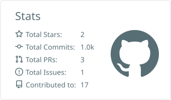

  
  
  
  
  

Web Engineer & Data Scientist — currently focused on AI × Python × TypeScript.

### Tech Stack

### Stats

  
  

<!-- Auto-generated once the METRICS_TOKEN secret is set -->
<!--  -->

### Activity

### Selected Work

<!-- Auto-synced with pinned repositories (sync-content.yml). Change your pins and this list follows. -->
<!-- PINS:START -->
- **[accommodation-app](https://github.com/mori-tt/accommodation-app)**
- **[notion_clone](https://github.com/mori-tt/notion_clone)**
- **[pokemon-omikuji2](https://github.com/mori-tt/pokemon-omikuji2)**
- **[react_discord](https://github.com/mori-tt/react_discord)**
- **[Tourism_recommendation_bot_3](https://github.com/mori-tt/Tourism_recommendation_bot_3)**
- **[trello-clone](https://github.com/mori-tt/trello-clone)**
<!-- PINS:END -->

### Articles

<!-- Top Zenn/Qiita articles by likes, auto-updated daily (sync-content.yml) -->
<!-- ARTICLES:START -->
- ❤️ **26** — [金融取引分析エージェント(AIとデータサイエンス)- Python & Google ADKで金融取引戦略を生成](https://zenn.dev/mmmot/articles/560829d90036dc) 
- ❤️ **17** — [Tailwind CSS まとめ](https://qiita.com/morrrrr/items/d0dfa70ede3165d01b36) 
- ❤️ **14** — [Reactの状態管理の比較(useState, useReducer, Redux, Jotai, Zustand)](https://qiita.com/morrrrr/items/be789f4926d6b531213b) 
- ❤️ **11** — [chatGPTのAPIを使った東京観光情報BOTの開発と実装](https://qiita.com/morrrrr/items/8bcb0b11352d8fb5e793) 
- ❤️ **9** — [NEXT.JSで静的サイトを作る方法（格安レンタルサーバーにもデプロイできる）](https://qiita.com/morrrrr/items/0be73991a305140969de) 
<!-- ARTICLES:END -->

