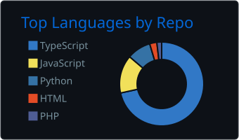
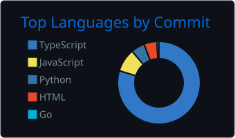
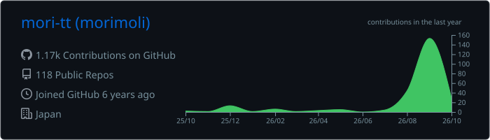
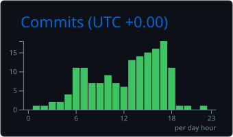

  
  
  
  

Web アプリと AI ツールを個人開発しています。最近は生成 AI × Next.js が中心。

---

### Tech Stack

### Stats

  
  

<!-- METRICS_TOKEN シークレット設定後に自動生成されます -->
<!--  -->

### Languages

  
  

### Activity

<!-- 過去1年分のコントリビューションカレンダー -->

### Selected Work

<!-- ピン留めリポジトリと自動同期されます (sync-content.yml)。ピン留めを変えるとこのリストも変わります -->
<!-- PINS:START -->
- **[accommodation-app](https://github.com/mori-tt/accommodation-app)**
- **[notion_clone](https://github.com/mori-tt/notion_clone)**
- **[pokemon-omikuji2](https://github.com/mori-tt/pokemon-omikuji2)**
- **[react_discord](https://github.com/mori-tt/react_discord)**
- **[Tourism_recommendation_bot_3](https://github.com/mori-tt/Tourism_recommendation_bot_3)**
- **[trello-clone](https://github.com/mori-tt/trello-clone)**
<!-- PINS:END -->

### Articles

<!-- Zenn/Qiita の記事をいいね順で自動更新します (sync-content.yml) -->
<!-- ARTICLES:START -->
- ❤️ 26 — [金融取引分析エージェント(AIとデータサイエンス)- Python & Google ADKで金融取引戦略を生成](https://zenn.dev/mmmot/articles/560829d90036dc)
<!-- ARTICLES:END -->

